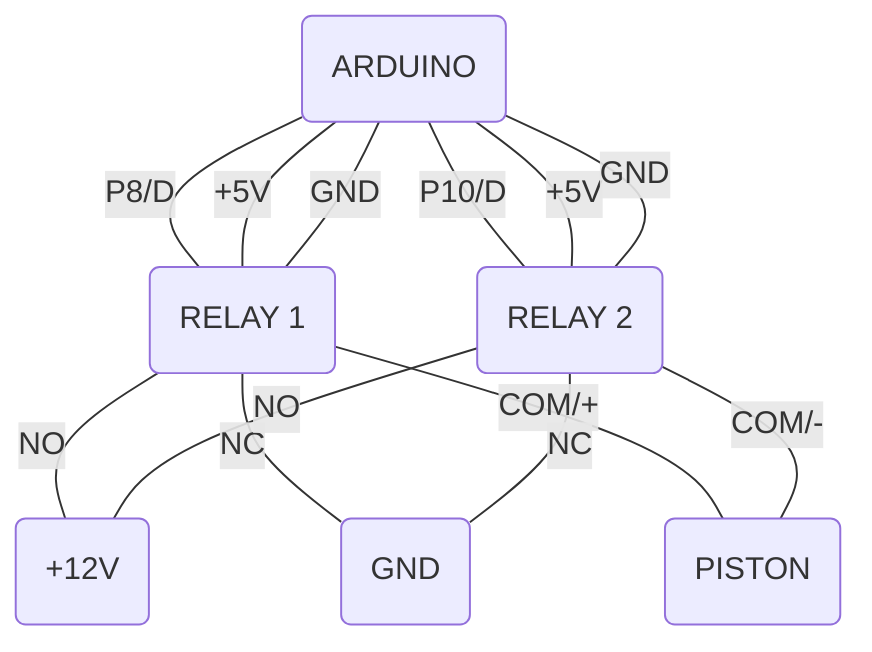

# Pennywise

```mermaid
graph TB

AR(ARDUINO)
R1(RELAY 1)
R2(RELAY 2)
P(PISTON)
VCC(+12V)
GND(GND)

AR --- |P8/D| R1
AR --- |P10/D| R2

AR ---|+5V| R1 & R2
AR ---|GND| R1 & R2

R1 ---|NO| VCC
R1 ---|NC| GND

R2 ---|NO| VCC
R2 ---|NC| GND

R1 --- |COM/+| P
R2 --- |COM/-| P

```
