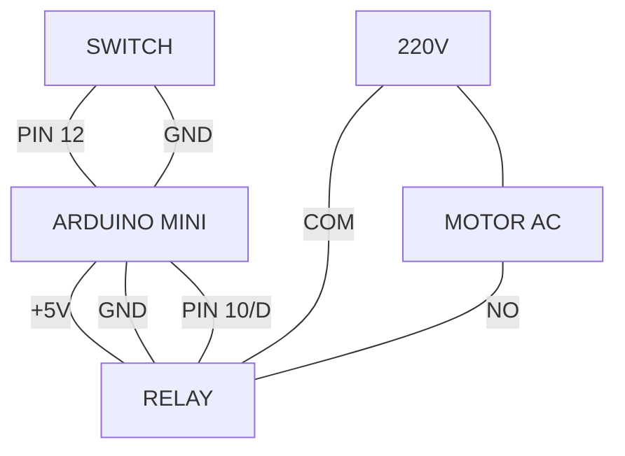

# Sam

The graph below represents the circuit design.

```mermaid
graph TD

M1[MOTOR AC]
RL[RELAY]
S[SWITCH]
AR[ARDUINO MINI]

AR ---|GND| S
S ---|PIN 12| AR

AR ---|+5V| RL
AR ---|GND| RL
AR ---|PIN 10/D| RL

220V ---|COM| RL
220V --- M1
M1 ---|NO| RL
```
